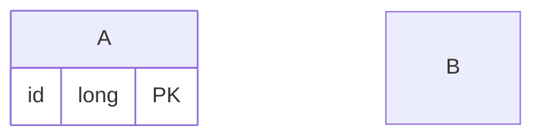

# MatchGame
Projeto Integrador 2 de Computação

## Descrição
- Aplicação web de encontros e registros de partidas esportivas, com sistemas de recompensas e ranqueamentos para incentivar a contínua prática de esportes.
- O sistema de criação de partidas permite você primeiramente escolher o tipo de partida convidar outro usuário para representar o outro time, e assim começar a convidar outros usuários para preencher os times, ao final da partida os dois representantes precisam confirmar o resultado do jogo.
- No perfil de usuário será mostrado além das informações básicas que compõem o perfil do usuário informações de partidas participadas e seus resultados, esportes preferidos, posições preferidas nesses esportes e etc...

